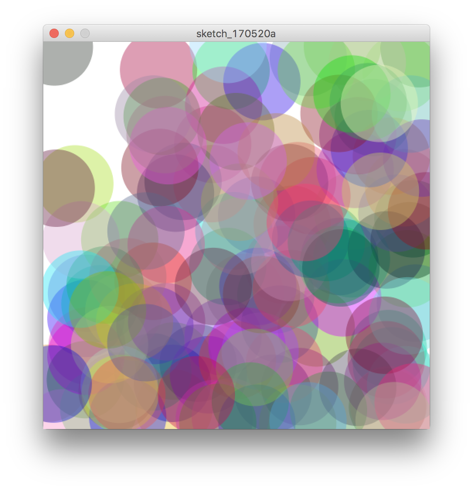

# ランダムとノイズ


参考: [The Book of Shader: ジェネラティブデザイン](https://thebookofshaders.com/10/?lan=jp)


&nbsp;
&nbsp;

## ランダム

ランダムな数値データを作る式。random(128, 256)と指定すると、128以上で256未満の範囲から乱数を1つ生成します。

```
// 50〜200の間でランダムな数値（float）を返す
random(50,200);

```


&nbsp;
&nbsp;

### サンプルコード1


```
function setup() {
    createCanvas(500,500);
    background(255);
    noStroke();
}

function draw() {
    fill(random(0,255),random(0,255),random(0,255),100); // 塗りがランダム
    circle(random(0,500),random(0,500),100); // 円の座標をランダムにして描く
}
```


&nbsp;
&nbsp;

### サンプルコード2 ランダム・ウォーカー


```
// グローバル変数の宣言　コード全体で使える変数
let x;
let y;
let randomX;
let randomY;

function setup() {
  createCanvas(400, 400);
  x = width/2;
  y = height/2;
}

function draw() {
  background(240,50);
  noStroke();
  fill(0,255,255,127);
  circle(x, y, 50); // 円を描画
  
  // -4から4の間でランダムな数値を生成
  randomX = random(-4,4);
  randomY = random(-4,4);
  
  //ランダム値をx座標とx座標に足す
  x = x + randomX;
  y = y + randomY;
}
```


&nbsp;
&nbsp;

---

&nbsp;
&nbsp;


## ノイズ

自然物を表現するときのテクスチャや地形描写などで使われる
パーリンノイズの生成に使う。0.0 から1.0 の間の数値（float）を返す。

```
noise(time);

```


&nbsp;
&nbsp;


#### サンプルコード1
```
let time = 3; //時間

function setup() {
  createCanvas(400, 400);
}

function draw(){
	//ノイズ関数から出力された値 
   let n = noise(time);
   print(n);
}

```


出力結果は同じ値になる


&nbsp;
&nbsp;


#### サンプルコード2
```
let time = 3; //時間

function setup() {
  createCanvas(400, 400);
}

function draw(){
   time += 0.01; //時間の値をインクリメント
   //ノイズ関数から出力された値 
   let n = noise(time);
   print(n);
}

```


出力結果が変動していく

&nbsp;
&nbsp;

#### サンプルコード3


&nbsp;
&nbsp;