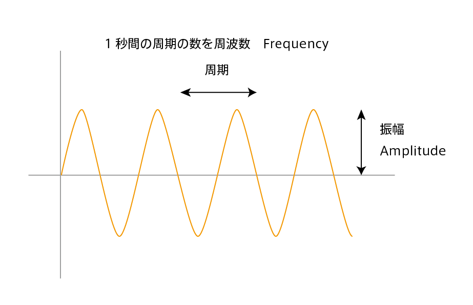

# シンセサイザー


## 音響合成

音は空気の振動。空気中に「波」として耳に伝わる（音波）
コンピュータでデジタル音を生成するには波形を作る。

* 振幅（Amplitude）が音の大きさ
* 周波数（Frequency）が音の高さ
 
 


&nbsp;

 
### オシレーター Oscillator

オシレーターと呼ばれる周波数の波を発振する仕組みで音を生成する
波の種類で音が変わる
 
 


```
import processing.sound.*;

SinOsc osc; //サイン波
float freq; // 周波数

void setup() {
  size(512, 512);
  background(255);
  
  osc = new SinOsc(this);
  osc.play();
  
  freq = 440;

}

void draw() {
  background(0);
   
  osc.freq(freq);
}

```

* サイン波 SinOsc
* ノコギリ波 SawOsc
* 三角波 TriOsc
* 矩形波 SqrOsc


&nbsp;


### MIDIノート番号と周波数

音階を周波数に変換する MIDI to Frequency


```

import processing.sound.*;

SinOsc osc; //サイン波
float freq; // 周波数
int noteNumber; // 音階


void setup() {
  size(512, 512);
  background(255);
  
  osc = new SinOsc(this);
  osc.play();
  
  noteNumber = 74;

}

void draw() {
  background(0);
  osc.freq(midiToFreq(noteNumber));
}

// ノートナンバーから周波数に変換する関数
float midiToFreq(int note){
  float freqVal = (pow(2, ((note-69)/12.0)))*440;
  return freqVal;
}

```